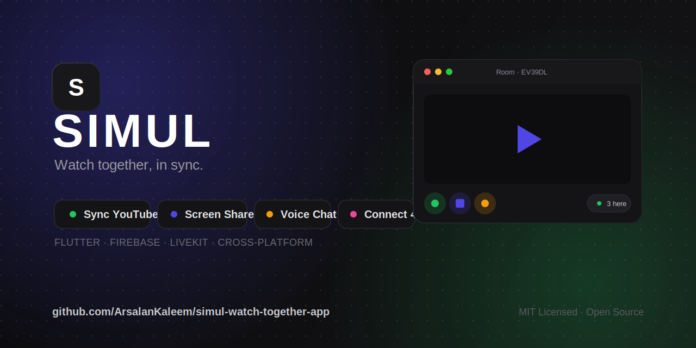
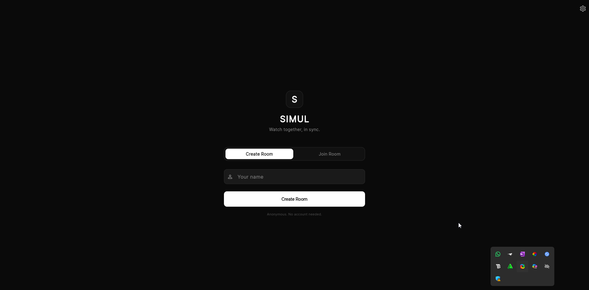
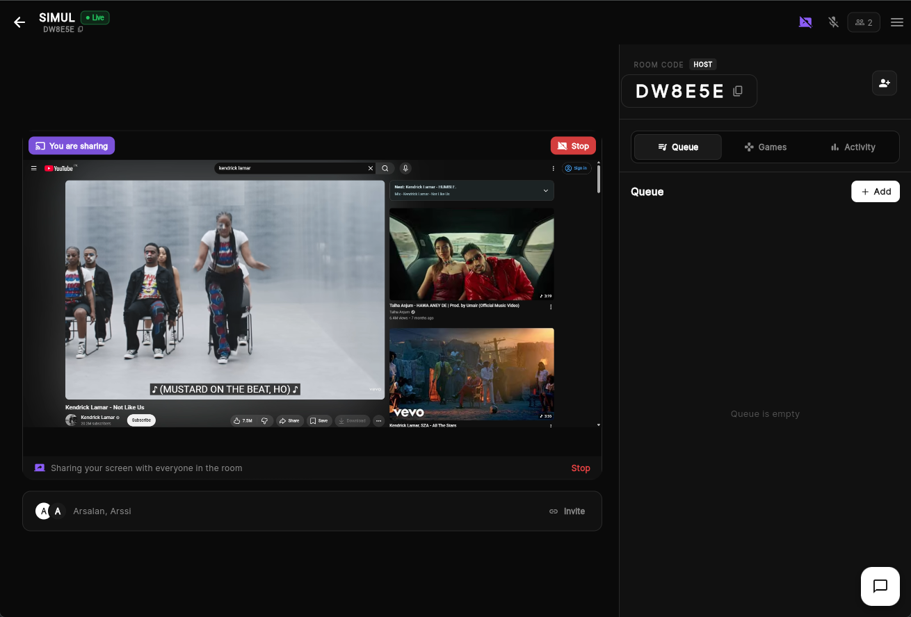
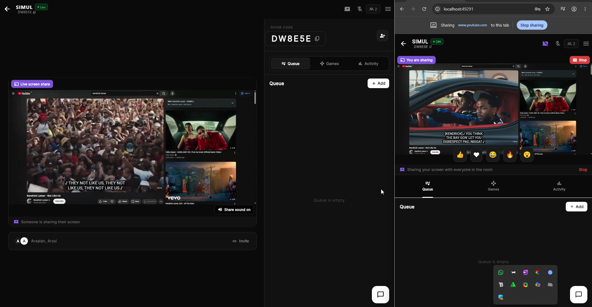
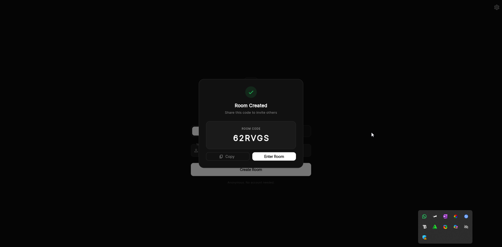

<div align="center">



# 🎬 SIMUL

### Watch together, in sync.

A cross-platform Flutter app to watch YouTube in perfect sync with friends — with voice chat, screen sharing (audio included), live reactions, and a quick game of Connect 4, all in one shared room.

<br/>

[](LICENSE)
[](https://flutter.dev)
[](https://firebase.google.com)
[](https://livekit.io)
[](CONTRIBUTING.md)

[](https://github.com/ArsalanKaleem/simul-watch-together-app/actions/workflows/flutter-ci.yml)
[](#-platform-support)
[](https://github.com/ArsalanKaleem/simul-watch-together-app/stargazers)

<br/>

[**Features**](#-features) · [**Screenshots**](#-screenshots) · [**Quick Start**](#-quick-start) · [**Usage**](#-usage-guide) · [**Configuration**](#%EF%B8%8F-configuration) · [**Contributing**](#-contributing) · [**Author**](#-author)

</div>

---

## 📖 About

**SIMUL** turns solo watching into a shared experience. Create a room, send a friend the code, and everything stays in sync — when one person pauses, everyone pauses. Add your voice, share a tab (with sound), drop reactions, and settle who's right with a game of Connect 4, without ever leaving the room.

It's fully cross-platform from a single Flutter codebase, uses **Firebase** for rooms/chat/sync and **LiveKit** for real-time voice and screen sharing, and is **open source** under the MIT license.

---

## ✨ Features

- 🎬 **Synced YouTube playback** — play, pause, and seek stay in sync for everyone in the room
- 🖥️ **Screen sharing with audio** — share a browser tab or your desktop, *with sound*
- 🔊 **Live voice chat** — talk over LiveKit while you watch
- 🔇 **Per-viewer audio control** — each viewer can mute shared audio locally, without affecting anyone else
- 💬 **Live chat & reactions** — a floating chat panel plus animated emoji reactions
- 🎮 **Connect 4** — tap a column to join and play, no separate step
- 🌗 **Light / dark mode** — theme engine and toggle built in
- 🔐 **In-app setup** — paste your own LiveKit keys in Settings; stored securely on-device, tokens minted locally (no server required)
- 📱 **Truly cross-platform** — Web, Windows, macOS, Linux, Android & iOS

---

## 📸 Screenshots


<p align="center">
  
  
  
</p>

<p align="center">
  <b>Authentication</b> &nbsp;&nbsp;&nbsp;&nbsp;&nbsp;&nbsp;&nbsp;&nbsp;
  <b>Room</b> &nbsp;&nbsp;&nbsp;&nbsp;&nbsp;&nbsp;&nbsp;&nbsp;
  <b>Screen Share</b>
</p>

<p align="center">
  
</p>

<p align="center">
  <b>Room Code</b> &nbsp;&nbsp;&nbsp;&nbsp;&nbsp;&nbsp;
</p>

---

## 🧱 Tech Stack

| Layer | Technology |
|---|---|
| **Framework** | [Flutter](https://flutter.dev) (Dart) |
| **Backend** | [Firebase](https://firebase.google.com) — Auth + Cloud Firestore (rooms, chat, presence, sync, game) |
| **Real-time media** | [LiveKit](https://livekit.io) — WebRTC voice + screen share |
| **State management** | [provider](https://pub.dev/packages/provider) |
| **Secure storage** | [flutter_secure_storage](https://pub.dev/packages/flutter_secure_storage) |

---

## 🗺️ Architecture

Two backends, handled differently:

- **Firebase** powers rooms, chat, presence, sync state, and Connect 4 — it comes preconfigured.
- **LiveKit** powers voice and screen share — each user supplies **their own** project via the in-app **Settings** screen. The app mints its own join tokens on-device, so there's **no token server to deploy**.

```
┌────────────┐   Firebase (preconfigured)   ┌──────────────┐
│  SIMUL app │ ─────────────────────────────►│ Firestore+Auth│
└─────┬──────┘   rooms · chat · sync · game   └──────────────┘
      │
      │ voice + screen share
      │ token minted on-device from keys pasted in Settings
      ▼
  YOUR LiveKit project (wss://…livekit.cloud)
```

---

## 🚀 Quick Start

### Prerequisites
- [Flutter SDK](https://docs.flutter.dev/get-started/install) (stable channel)
- A free [LiveKit Cloud](https://cloud.livekit.io) account — no credit card required

### 1. Clone & install
```bash
git clone https://github.com/ArsalanKaleem/simul-watch-together-app.git
cd simul-watch-together-app
```
Add two dependencies to `pubspec.yaml` (also in [`pubspec.additions.yaml`](pubspec.additions.yaml)):
```yaml
dependencies:
  flutter_secure_storage: ^9.2.2
  crypto: ^3.0.5
```
Then:
```bash
flutter pub get
flutter run -d chrome     # or windows / macos / linux / a device
```

### 2. Connect your LiveKit project
1. Create a free project at **[cloud.livekit.io](https://cloud.livekit.io)**.
2. **Settings → Keys** → create an API Key (copy the key + secret shown once).
3. Copy your project URL — `wss://your-project.livekit.cloud`.
4. In the app: tap **⚙️ Settings** → paste **URL**, **API Key**, **API Secret** → **Save**.

You're live. Create a room, share the code, and start watching together. 🎉

---

## 📖 Usage Guide

### Create or join a room
- **Create:** Home → *Create Room* → enter your name → copy the 6-character code that appears.
- **Join:** Home → *Join Room* → enter your name and the room code.

### In a room
| Action | How |
|---|---|
| Load a video | Paste a YouTube URL into the bar under the player |
| Voice chat | Tap the 🎤 mic icon in the top bar |
| Share screen | Tap 🖥️ (desktop) or **drawer → Share Screen** (mobile). Pick a **tab** and tick **"Share tab audio"** for sound |
| Mute shared audio (just you) | Tap the speaker icon on the share view |
| Chat | Tap the floating chat bubble, bottom-right |
| React | Use the reaction bar (toggle from the drawer) |
| Play Connect 4 | Open **Games** → **Start** → tap any column to join |
| Invite others | Drawer (≡) → **Invite to Room** |
| Switch theme | Drawer → **Light/Dark Mode**, or from Settings |
| Leave | Back arrow, top-left |

---

## ⚙️ Configuration

| What | Where | Who sets it |
|---|---|---|
| Firebase | `lib/firebase_options.dart` | Maintainer (preconfigured) |
| LiveKit URL / key / secret | **In-app Settings** → secure storage | **Each user** |
| Token server (optional) | `token-server/.env` + Settings → Advanced | Advanced users |
| Firestore rules | `firestore.rules` | `firebase deploy --only firestore:rules` |

<details>
<summary><strong>Local development (no cloud)</strong></summary>

```bash
livekit-server --dev   # ws://localhost:7880, key=devkey secret=secret
```
In Settings, enter URL `ws://localhost:7880`, Key `devkey`, Secret `secret`.
</details>

<details>
<summary><strong>LiveKit free tier</strong></summary>

The free **Build** plan (no card) offers ~5,000 participant-minutes and ~50 GB/month — roughly **~40 hours/month of 2-person sessions**. See [livekit.com/pricing](https://livekit.com/pricing) for current numbers.
</details>

---

## 📁 Project Structure

```
lib/
├── main.dart                    # entry; providers + theming
├── firebase_options.dart        # Firebase config (preconfigured)
├── screens/                     # auth, room, settings, about, splash
├── services/                    # firebase, livekit, token minting, sync, game, theme
├── widgets/                     # chat, reactions, queue, game, share viewer
└── utils/constants.dart         # theme palette + config
token-server/                    # optional token server (advanced)
firestore.rules                  # security rules
docs/                            # guides, changelogs, screenshots
```

---

## 💻 Platform Support

| Web | Android | iOS | Windows | macOS | Linux |
|:---:|:---:|:---:|:---:|:---:|:---:|
| ✅ | ✅ | ✅ | ✅ | ✅ | ✅ |

---

## 🗺️ Roadmap

- [ ] Full app-wide light/dark coverage — [tracked issue](docs/issues/dark-mode-support.md)
- [ ] Web-only volume slider for shared audio
- [ ] Automated test suite
- [ ] Real screenshots & demo GIF

---

## 🤝 Contributing

Contributions are welcome! Read [CONTRIBUTING.md](CONTRIBUTING.md), then look for
[`good first issue`](https://github.com/ArsalanKaleem/simul-watch-together-app/labels/good%20first%20issue)
labels. Please run `flutter analyze` before opening a PR.

---

## 👤 Author

**Arsalan Kaleem**

[](https://arsalankaleem.github.io/portfolio/)
[](https://github.com/ArsalanKaleem)
[](https://www.linkedin.com/in/arsalankaleem)

---

## 📄 License

Distributed under the **MIT License**. See [LICENSE](LICENSE) for details.

<div align="center">

**If you find SIMUL useful, consider giving it a ⭐ — it really helps!**

<sub>Built with Flutter, Firebase & LiveKit · © 2026 Arsalan Kaleem</sub>

</div>
